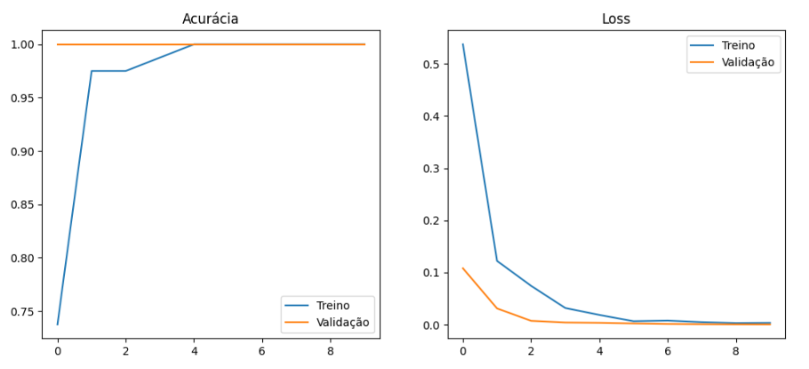
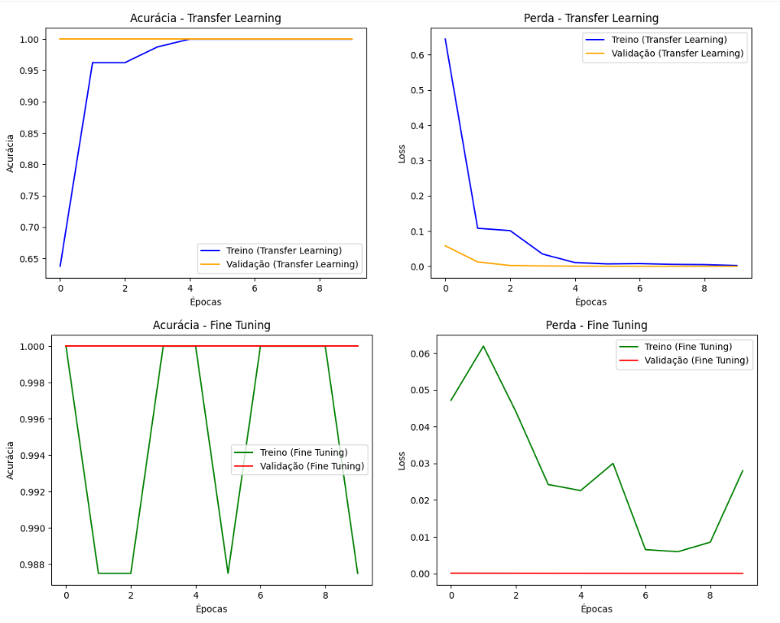
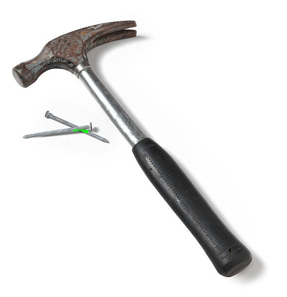

# Faculdade de Informática e Administração Paulista 

<p align="center">
  <a href="https://www.fiap.com.br/">
    
  </a>
</p>

<br>

## Grupo 32

## Integrantes: 
- <a href="https://github.com/FelipeSabinoTMRS">Felipe Sabino da Silva</a>
- <a href="https://github.com/juanvoltolini-rm562890">Juan Felipe Voltolini</a>
- <a href="https://github.com/Luiz-FIAP">Luiz Henrique Ribeiro de Oliveira</a> 
- <a href="https://github.com/marcofiap">Marco Aurélio Eberhardt Assimpção</a>
- <a href="https://github.com/PauloSenise">Paulo Henrique Senise</a> 

## Professores:
### Tutor(a) 
- <a href="https://github.com/Leoruiz197">Leonardo Ruiz Orabona</a>
### Coordenador(a)
- <a href="https://github.com/agodoi">André Godoi</a>

---

# Projeto Fase 6 – Ir Além 2 

Este repositório documenta a implementação completa da tarefa **Ir Além 2** da Fase 6, que envolve o uso de **Transfer Learning + Fine Tuning** e **segmentação de imagens** para melhorar a classificação de objetos. Inclui explicações teóricas, comparações de desempenho e exemplos práticos de segmentação e treinamento.

---

## Sumário
1. [Estrutura do Projeto](#estrutura-do-projeto)
2. [Configuração e Dataset](#configuração-e-dataset)
3. [Modelo Transfer Learning (MobileNetV2)](#modelo-transfer-learning)
4. [Treinamento Inicial e Métricas](#treinamento-inicial)
5. [Fine-Tuning e Resultados](#fine-tuning)
6. [Segmentação com DeepLabV3+](#segmentação-deeplabv3)
7. [Geração de Máscaras e Overlays](#geração-máscaras)
8. [Comparação e Análise de Métricas](#comparação-e-análise)
9. [Conclusão Final](#conclusão)

---

## Estrutura do Projeto
```
Fase6_IrAlem2/
│
├── README.md
├── notebooks/
│   └── fase6_ir_alem2.ipynb
├── dataset/
│   ├── train/
│   │   ├── escova/
│   │   └── martelo/
│   ├── val/
│   │   ├── escova/
│   │   └── martelo/
│   └── test/
│       ├── escova/
│       └── martelo/
├── results/
│   ├── escova/
│   └── martelo/
└── docs/examples/
    ├── grafico_fine_tuning.png
    ├── grafico_transfer_learning.png
    ├── overlay_escova.jpg
    ├── overlay_martelo.jpg
    ├── logo-fiap.png
```

---

## Configuração e Dataset

O Google Drive foi montado para armazenar os dados e modelos. O dataset foi dividido em **train**, **val** e **test**, com duas classes: `escova` e `martelo`. Cada conjunto contém 40 imagens por classe, além de 4 para validação e 4 para teste.

A normalização das imagens foi feita com `Rescaling(1./255)` para converter os valores de pixel entre 0 e 1. As operações `cache()` e `prefetch()` otimizam o carregamento em GPU.

---

## Modelo Transfer Learning

O modelo base utilizado foi o **MobileNetV2** com pesos pré-treinados na **ImageNet**.

```python
base_model = tf.keras.applications.MobileNetV2(
    input_shape=(224,224,3),
    include_top=False,
    weights='imagenet'
)
base_model.trainable = False
```

Foi adicionado um *GlobalAveragePooling2D* seguido de camadas *Dense* e *Dropout* para evitar overfitting.

**Camadas finais:**
```python
model = tf.keras.Sequential([
    base_model,
    tf.keras.layers.GlobalAveragePooling2D(),
    tf.keras.layers.Dense(128, activation='relu'),
    tf.keras.layers.Dropout(0.3),
    tf.keras.layers.Dense(2, activation='softmax')
])
```

---

## Treinamento Inicial

O modelo foi treinado por 10 épocas. As métricas coletadas foram *accuracy* e *loss*.



**Análise:**
- Rápida convergência com boa estabilidade.
- Sem indícios de overfitting.
- Acurácia alta já nas primeiras épocas.

---

## Fine-Tuning

Após o treinamento inicial, as últimas 100 camadas foram descongeladas e re-treinadas com *learning rate* menor (`1e-5`). Isso permitiu que o modelo ajustasse pesos intermediários sem perder o conhecimento da ImageNet.



**Análise:**
- Acurácia de validação aumentou.
- Melhor equilíbrio entre generalização e especialização.
- Aprendizado mais lento e refinado.

---

## Segmentação com DeepLabV3+

O modelo **DeepLabV3+**, pré-treinado no dataset Pascal VOC, foi carregado via arquivo `frozen_inference_graph.pb`.

### Função de Carregamento:
```python
def load_frozen_graph(model_path):
    graph = tf.Graph()
    with tf.io.gfile.GFile(model_path, 'rb') as f:
        graph_def = tf.compat.v1.GraphDef()
        graph_def.ParseFromString(f.read())
    with graph.as_default():
        tf.import_graph_def(graph_def, name='')
    return graph
```

A função **segment_image()** aplica o modelo à imagem, gerando uma **máscara** que destaca o objeto de interesse (escova ou martelo) pixel a pixel.

**Resultado visual:**

<p float="left">
     
    
</p>

---

## Geração de Máscaras e Overlays

O código percorre todas as imagens de `train`, `val` e `test`, executando a segmentação e salvando os resultados em pastas dedicadas (`results_segmentados/`).

Função principal:
```python
def create_overlay(original, mask, color):
    overlay = original.copy()
    overlay[mask == 1] = color
    return cv2.addWeighted(original, 0.6, overlay, 0.4, 0)
```

A função **mostrar_exemplos()** exibe 3 imagens segmentadas por classe para visualização no Colab.

---

## Comparação e Análise de Métricas

| Critério | Transfer Learning | Fine-Tuning | Segmentação (DeepLabV3+) |
|----------|------------------|--------------|----------------------------|
| **Precisão** | Boa | Excelente | Excelente + Visual clara |
| **Tempo de Treinamento** | Baixo | Médio | Alto |
| **Generalização** | Boa | Ótima | Ótima |
| **Complexidade** | Baixa | Moderada | Alta |
| **Resultado Final** | Classifica corretamente | Refina decisão | Destaca e interpreta o objeto |

**Conclusão:**
- O *Fine-Tuning* refinou o modelo, aumentando acurácia e estabilidade.
- A segmentação com DeepLabV3+ trouxe valor interpretativo adicional.

---

## Interpretação dos Gráficos

### 1️⃣ Gráfico de Acurácia
- **Linha azul (treino)** → aumento contínuo da acurácia.
- **Linha laranja (validação)** → acompanha a curva de treino, mostrando boa generalização.

### 2️⃣ Gráfico de Perda
- **Loss** reduz de forma consistente.
- Quando *val_loss* cresce enquanto *train_loss* cai, há sinais de *overfitting*.

Esses padrões foram usados para ajustar o número de épocas e o *learning rate*.

---

## Comparação com Entregas Anteriores
Além das técnicas testadas nesta entrega, já havíamos explorado outras abordagens:

| Abordagem | Tarefa | Facilidade | Precisão | Custo (Tempo) | Velocidade | Veredito |
|-----------|--------|------------|----------|---------------|------------|----------|
| **CNN do Zero** | Classificação | ★☆☆ | ★★★ | ★☆☆ | ★★★ | Eficaz, mas limitada (só classifica, não detecta/localiza) |
| **YOLO (customizado)** | Detecção | ★★☆ | ★★★ | ★★☆ | ★★☆ | Solução ideal para detecção e localização |
| **Transfer Learning (MobileNetV2)** | Classificação | ★★☆ | ★★☆ | ★☆☆ | ★★★ | Rápido e eficiente com poucos dados |
| **Fine-Tuning** | Classificação | ★★☆ | ★★★ | ★★☆ | ★★☆ | Refina e melhora a generalização |
| **Segmentação (DeepLabV3+)** | Segmentação | ★☆☆ | ★★★ | ★★★ | ★★☆ | Mais complexo, mas traz interpretabilidade visual |

### Conclusão Integrada
- **CNN do Zero** → Boa para aprendizado, mas incompleta.  
- **YOLO Customizado** → Melhor solução para **detecção real de objetos**.  
- **Transfer Learning + Fine-Tuning** → Ótimo equilíbrio entre precisão e rapidez em **classificação**.  
- **Segmentação** → Agrega **explicabilidade** e visualização clara, útil para relatórios e validação.

## Conclusão Final

A combinação de **Transfer Learning + Fine-Tuning + Segmentação** demonstrou ser a mais eficiente e explicável para o problema proposto.

- **Transfer Learning:** rápido e eficiente com poucos dados.
- **Fine-Tuning:** melhora gradual e refinamento do modelo.
- **Segmentação:** fornece uma camada extra de interpretação visual.

O uso de redes pré-treinadas combinado ao refinamento seletivo de camadas e à segmentação visual com DeepLabV3+ resultou em um pipeline robusto, equilibrando desempenho, interpretabilidade e aplicabilidade prática.

## Vídeo de Demonstração
[[Link para vídeo no YouTube](https://youtu.be/Dd15XC_cJdU)]
